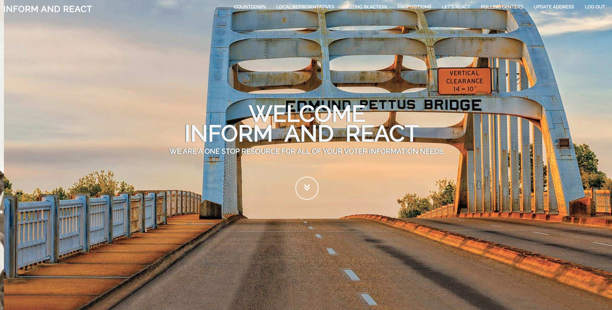
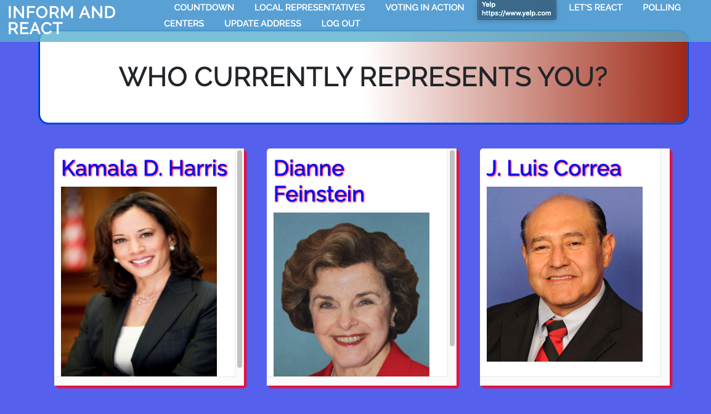

# INFORM AND REACT

## CONCEPT

This application was designed with the American voter in mind that would like to make their vote count, but does not have the necessary information in order to make an informed decision.  In this app, the user will be able to enter their address upon signup, have that address saved in their login profile, and have their local representatives displayed, along with other address-driven functionality.  The user will also be provided with a countdown to the 2020 Election, dynamic rendering of their local representatives based on their address, information on propositions in their area, and other important election information.      

## USAGE

This application utilized the Google Civic Information API and Propublica API in order to produce a unique user experience across 3 webpages and 8 website sections.  In the home/landing page, the user is presented with a navigation bar with the following sections:

Countdown

Local Representatives

Voting in Action

Propositions

Let's React

Polling Centers

Update Address

Logout

Upon landing on the sign-up/log-in page page, the user will be asked to sign-up as a member or enter their log-in credentials.  The user will be prompted to enter their address.  Their address will be saved to the user's login profile and will be used to dynamically render address-driven information on the members page.  They will then be redirected to the members page and presented with a navigation bar with the above titles.   

## TECHNOLOGIES USED
 

API: Google Civic Information (drop-off locations, pros/cons for bills, etc)
 

API: ProPublica Congress

Axios

BCrypt - password authentication

Bootstrap library for HTML/CSS design and templating

Dotenv package for loading environment-specific variables

Express library for Node.js for routing

Heroku for app deployment

jQuery JavaScript library

MongoDB/Mongoose for database querying and management

Node.js for running JavaScript and servers

NPM Package: Swiper

Postman for testing back-end

React.js - animate, bootstrap, materialize, moment

Robo 3T - for testing Mongo DB

## PROCESS

Two of our greatest strengths were our ability to communicate and collaborate.  We were able to take advantage of each group member's specializations and unique skillsets.  It was this concept that allowed us to assign and manage tasks within the project effectively.  If a group member didn't understand or was overwhelmed by a task, we quickly called a meeting to resolve those issues.  We adapted to each member's interests with respect to assignments and deliverables.  We found that we worked more effectively when we were able to choose work that interested us, rather than relying on random assignment.  We had a review session for virtually every push to GitHub, and went over the changes to the code several times daily as a group.  This way, we were able to review pull requests and merge conflicts as group before merging from branches to the master.  We have a mutual respect for one another, and feel that we collectively complement each other nicely.  We faced and overcame so many challenges because of our mutual respect for one another, ability to compromise, and understanding of our diverse experiences and opinions.  

## CHALLENGES

Using React was one of the toughest challenges that we faced on this project.  Initially, we wanted to use a Bootstrap template that utilized JQuery for our main website template.  However, we quickly discovered that React and JQuery were not able to coexist in most of our pivotal functions.  We found that Bootstrap templates are not very prominent in the React world.  In the past, we have started with a Bootstrap template and customized it to our liking.  In this project, we were forced to take individual Bootstrap components and add them one by one, without the ability to logically style each component.  The front-end team was continuously frustrated with the rendering of sections, images, and other components that had illogical and inconsistent behavior.  

## SUCCESSES

We successfully executed a well-designed app that is both highly unique and useful. We were very collaborative and communicated well. We held scrum meetings before starting work on a daily basis to collectively share what we worked on the day before, what we would be working on that day, and any problems that we were facing. By doing this daily, we were able to stay on top of issues and to proactively discuss potential challenges that may be coming down the road. We were also able to utilize Agile methodology to complete small concept pieces of the project in order to test functionality and verify design.  Individually, we all had our individual struggles, ranging from our understanding of React to being burned out due to working too hard.  We are very proud of each team member's overcoming challenges, as well as each team member's ability to support each other in times of need.  

On an individual level, we all came up with some examples of obstacles that we faced, and how we were able to overcome them.

Anissa - One major obstacle I faced was trying to implement my front end design using jQuery with React. I found that the two were not able to exist and function seamlessly. I found it difficult creatively to design the layout using mainly React functionality so it was challenging trying to find alternatives to create my initial vision.

Kevin F. - React was definitely a challenge.  A lot of the expertise and knowledge that we have accumulated thus far proved to be very difficult to transition into the React environment.  I would like to thank each and every one in the group for their immeasurable assistance and unwavering support.  I would also like to thank Bryan, Wilson, and Chad for their patience, understanding, and getting us out of a lot of tough situations.     

Kevin M. - Proper routing and passing user authentication to the proper React components was the greatest challenge for me. I felt like I learned a lot through practice, as well as from my team members and instructors. Although the challenges were difficult, being a part of a great team really made this project into something I enjoyed working on, and an experience I would tackle again!

Sophia - I still feel very new to React and still learning what feels like basics. I was happy when we made the decision as a group to do all the front-end in React, but I eventually felt overwhelmed. I made the decision to start working front-end with just html/vanilla Javascript, and then transfer it over to React. That was very helpful and I got to learn a lot thru doing this. My lesson learned: when you’re stuck, simplify the solution.

Tim - Using React was very challenging.  There were moments where it felt as if anything I wanted to accomplish on the front-end was not going to be possible if we used React.  The interactivity between the various components was perplexing; components would overtake other components for reasons unknown.  As with most difficulties, not being afraid to ask for help made it so I could get through the challenges.  All credit and thanks to the endless patience of my teammates, tutor, instructor, and TA.  Nothing is insurmountable!  

## DIRECTIONS FOR FUTURE DEVELOPMENT

The groundwork has been laid, but there are several enhancements that could greatly improve the user experience:

Registered to vote statistics and map by (D) and (R)

Development of a section that features upcoming political events (debates, town halls, and rallies) and functionality that would help the user find these events on a map, and provide directions to these events.  

Swing states map and analysis to show impact of swing states in determining electon winner

## LINK TO GITHUB REPOSITORY
https://github.com/Koldenblue/Inform-and-React

## LINK TO HEROKU DEPLOYED APP
https://inform-and-react.herokuapp.com

## IMAGES OF DEPLOYED APPLICATION

## AUTHORS AND ACKNOWLEDGEMENT

This project was collaboratively constructed by a team of Full-Stack Web Developers:

Front-End:  Anissa Shanks

            Tim Hellman

Back-End:   Kevin Miller

            Kevin Fujimoto

Front-End/Back-End Floater:   Sophia Castillo

We would also like to thank our instructor, Bryan Swarthout, TA, Wilson Lam, and tutor, Chad Tao for their tremendous help, patience, and understanding throughout our project.  We can't thank them enough!
